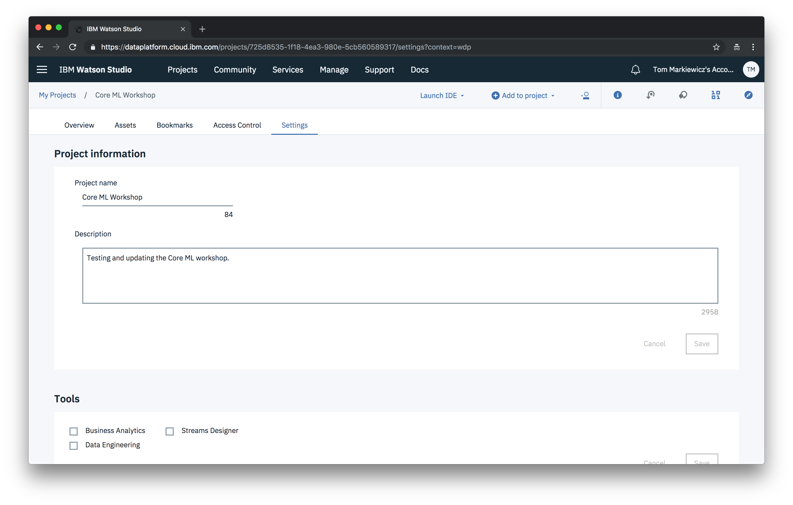
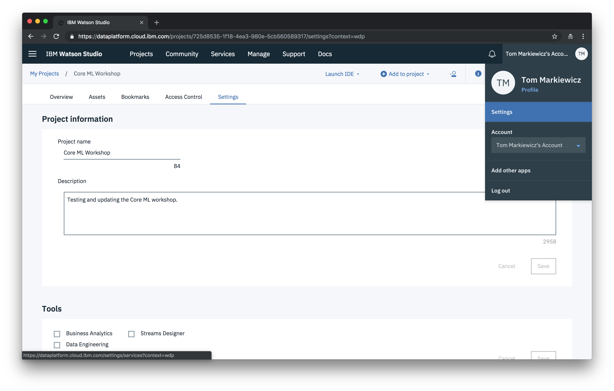
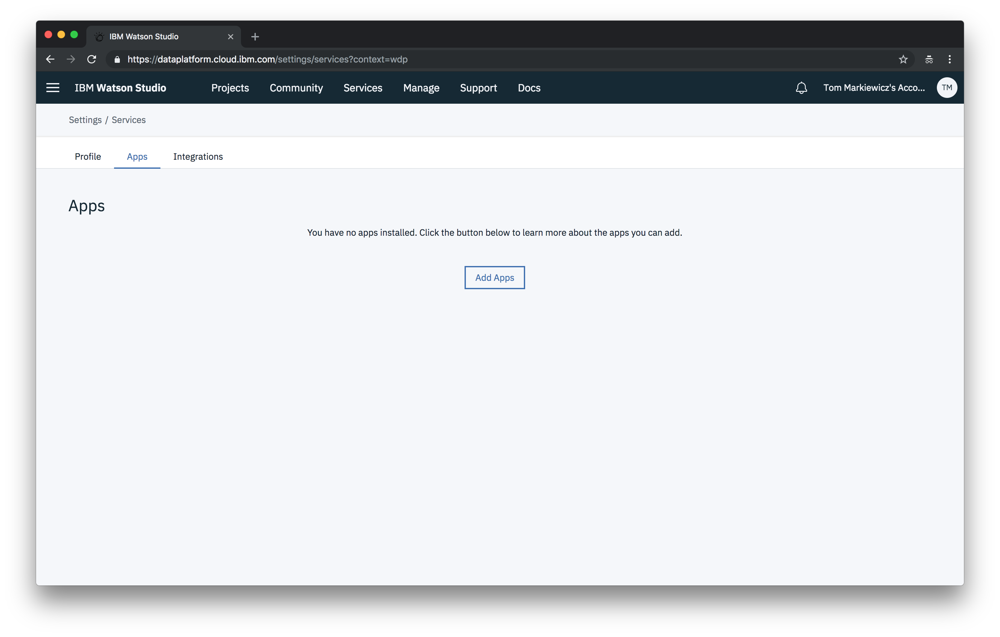
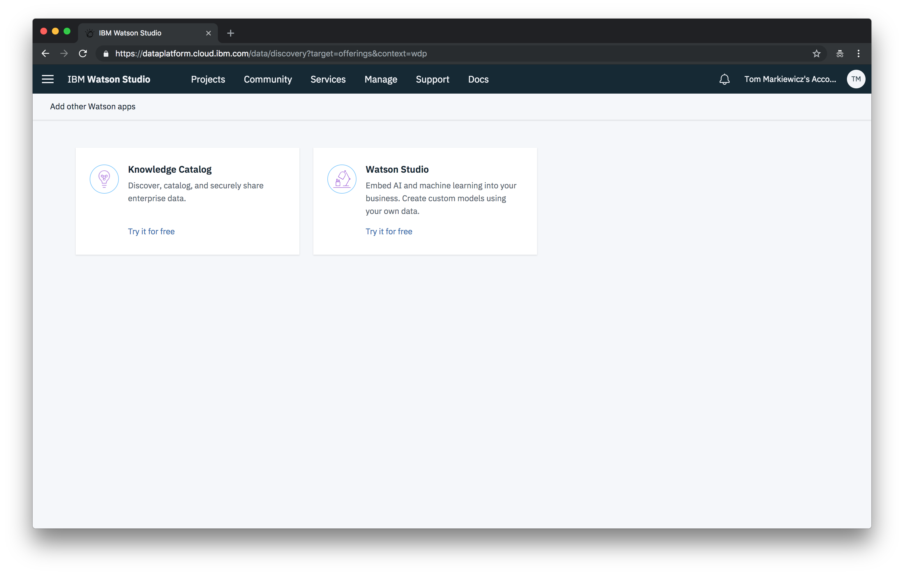
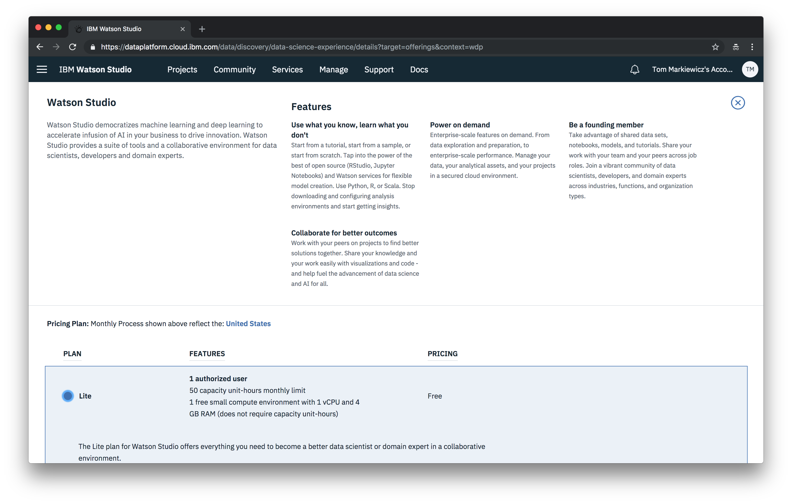
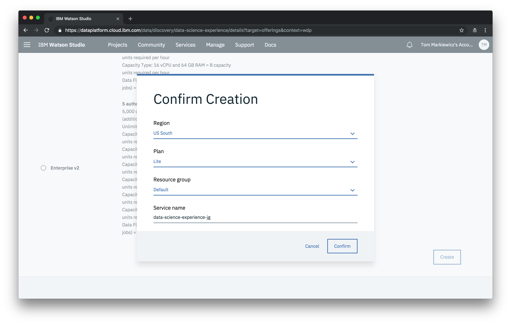
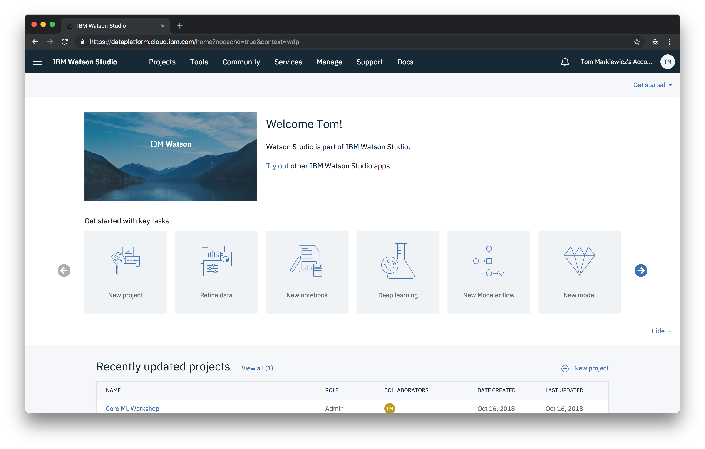

Once your project is created you will be directed to your new project’s page. If you need to find your way back to this page you can get to it by going to **Projects > My First Project** on the top bar.

The most important tabs are **Assets** and **Settings**.

### Settings

The settings page is where we finish setting up our project. We can also change things like the name of our project and the description.

However, the important thing we need to do here now is attach a new Visual Recognition service to our project.

Click on the **Settings** tab.

First, ensure that **Visual Recognition** is checked under **Tools**. This will unlock special abilities for our project, like creating a new Visual Recognition model. Once checked, make sure you save the change.

<!-- NEW STEPS FOR ADDING WATSON TOOLS -->

If you do not see an option for **Watson Tools**, you will need to perform the following steps. 

In the upper right hand corner of the page, click on the link for **Your Name's Account**

Next, click the link for **Settings**. This will take you a page displaying a link to **Add Apps**. Click this link.

Select **Watson Studio** by clicking the **Try it for free** link.

From the pricing plans, select the **Lite** plan and click **Create**.

Next, confirm its creation.

You're now taken to the **Watson Studio** dashboard.

From here, you'll need to go back to your project. From either the top navigation under **Projects** or in the **Recently updated projects** section, click on the link for your project to return.

Back in your project, click on **Settings** and look for the **Tools** section. Here you should now see **Watson Tools** as an unchecked option.

Now that **Watson Tools** is connected, make sure you save the change.

<!-- END -->

In order for us to be able to create a model, we need to spin up a Watson service called Visual Recognition. We can do this by clicking the **Add service** dropdown under **Associated services**.

Choose **Watson**.

And then add Visual Recognition at the bottom.

You can then choose a pricing plan like you did for Object Storage. Then click **Create** and **Confirm** on the following popup.
> **Note:** If you already have a Watson Visual Recognition service, you can choose it by clicking the **Existing** tab.

### Assets

The assets page is where all of you training data will live (it's also where your visual recognition models will live).

You can upload the training files you created (or downloaded) earlier by clicking **browse** or dragging them onto the drop zone.

You should then see a list of you training data show up.

